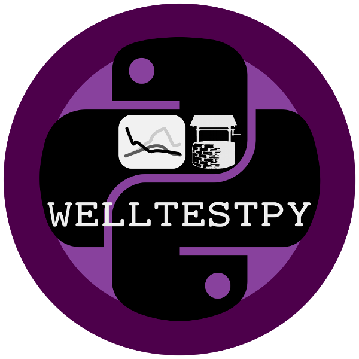

=====================
welltestpy Quickstart
=====================

welltestpy provides a framework to handle, process, plot and analyse data from well based field campaigns.

Installation
============

The package can be installed via `pip <https://pypi.org/project/welltestpy/>`_.
On Windows you can install `WinPython <https://winpython.github.io/>`_ to get
Python and pip running.

.. code-block:: none

    pip install welltestpy

Provided Subpackages
====================

The following functions are provided directly

.. code-block:: python

    welltestpy.data      # Subpackage to handle data from field campaigns
    welltestpy.estimate  # Subpackage to estimate field parameters
    welltestpy.process   # Subpackage to pre- and post-process data
    welltestpy.tools     # Subpackage with tools for plotting and triagulation

Requirements
============

- `NumPy >= 1.14.5 <https://www.numpy.org>`_
- `SciPy >= 1.1.0 <https://www.scipy.org>`_
- `Pandas >= 0.23.2 <https://pandas.pydata.org>`_
- `AnaFlow >= 1.0.0 <https://github.com/GeoStat-Framework/AnaFlow>`_
- `SpotPy >= 1.5.0 <https://github.com/thouska/spotpy>`_
- `Matplotlib >= 3.0.0 <https://matplotlib.org>`_

License
=======

`MIT <https://github.com/GeoStat-Framework/welltestpy/blob/master/LICENSE>`_
