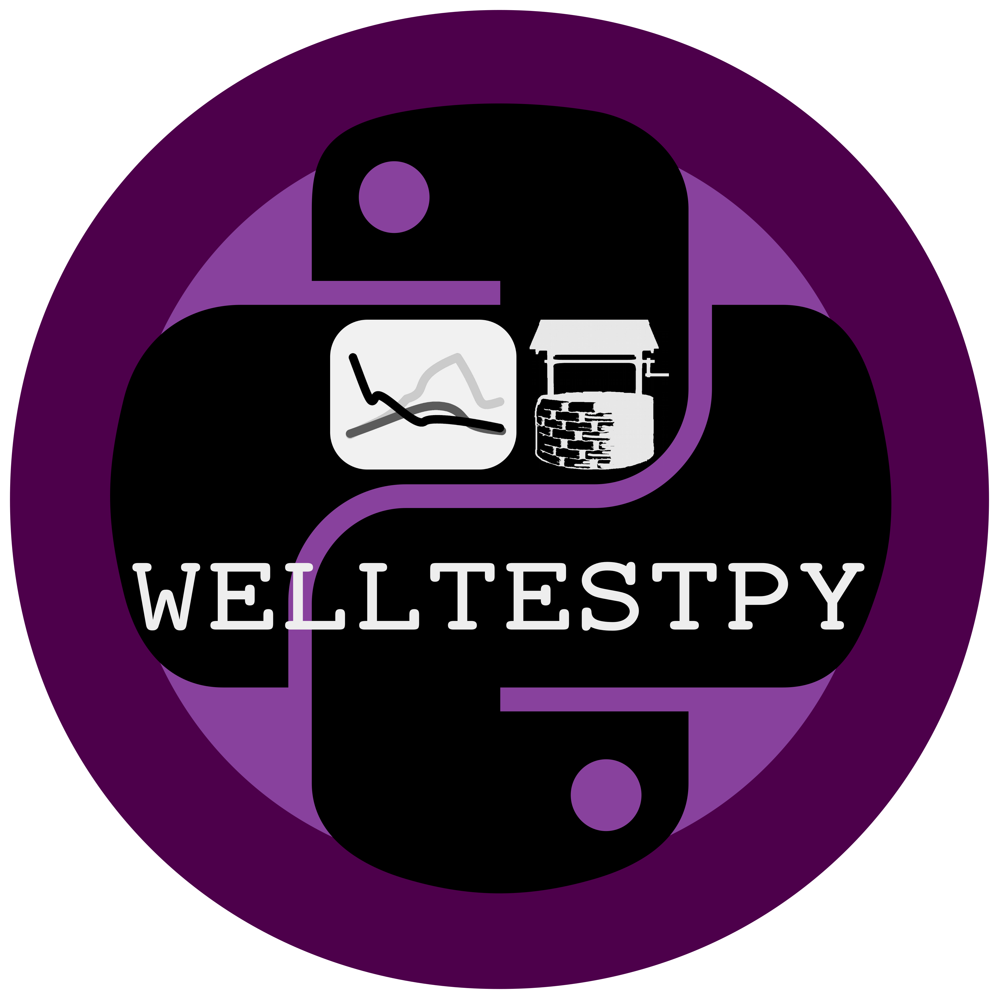

====================================================================
welltestpy: A python-package for handling well based field campaigns
====================================================================

About
-----
WellTestPy provides a framework to handle and plot data from well based
field campaigns as well as a data interpretation module.

Dependencies
------------
- `Numpy <http://www.numpy.org>`_: 1.10.0 or higher
- `SciPy <http://www.scipy.org>`_: 0.19.0 or higher
- `matplotlib <https://matplotlib.org>`_
- `anaflow <https://github.com/MuellerSeb/AnaFlow>`_

Installation
------------
Download the
`code <https://github.com/MuellerSeb/welltestpy/archive/master.zip>`_
from github and run the following command from the source code directory:

    ``pip install -U .``

It is highly recomended to install the scipy-scikit `umfpack` to get a solver
for sparse linear systems if you want to use the estimation routines:

    ``pip install -U scikit-umfpack``

Under Ubuntu you can install the required SuiteSparse library with:

    ``sudo apt-get install libsuitesparse-dev``

For further information have a look at:
    * http://pypi.python.org/pypi/scikit-umfpack
    * http://faculty.cse.tamu.edu/davis/suitesparse.html

Modules
-------
.. toctree::
   :maxdepth: 2

   main
