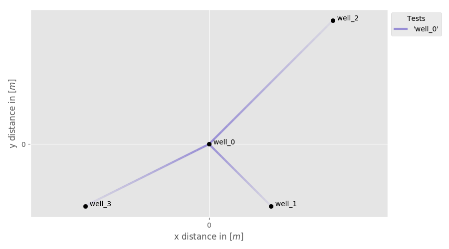
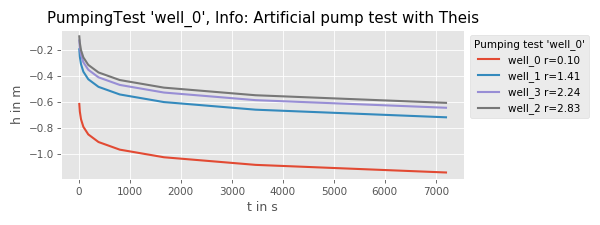

Tutorial 1: Create a Campaign containing a pumping test
=======================================================

In the following a simple pumping test is created with artificial drawdown data
generated by the Theis-solution.

.. code-block:: python

    import numpy as np
    import welltestpy as wtp
    import anaflow as ana

    ### create the field-site and the campaign
    field = wtp.data.FieldSite(name="UFZ", coordinates=[51.353839, 12.431385])
    campaign = wtp.data.Campaign(name="UFZ-campaign", fieldsite=field)

    ### add 4 wells to the campaign
    campaign.add_well(name="well_0", radius=0.1, coordinates=(0.0, 0.0))
    campaign.add_well(name="well_1", radius=0.1, coordinates=(1.0, -1.0))
    campaign.add_well(name="well_2", radius=0.1, coordinates=(2.0, 2.0))
    campaign.add_well(name="well_3", radius=0.1, coordinates=(-2.0, -1.0))

    ### generate artificial drawdown data with the Theis solution
    rate = -1e-4
    time = np.geomspace(10, 7200, 10)
    transmissivity = 1e-4
    storage = 1e-4
    rad = [
        campaign.wells["well_0"].radius,  # well radius of well_0
        campaign.wells["well_0"] - campaign.wells["well_1"],  # distance 0-1
        campaign.wells["well_0"] - campaign.wells["well_2"],  # distance 0-2
        campaign.wells["well_0"] - campaign.wells["well_3"],  # distance 0-3
    ]
    drawdown = ana.theis(
        time=time,
        rad=rad,
        storage=storage,
        transmissivity=transmissivity,
        rate=rate,
    )

    ### create a pumping test at well_0
    pumptest = wtp.data.PumpingTest(
        name="well_0",
        pumpingwell="well_0",
        pumpingrate=rate,
        description="Artificial pump test with Theis",
    )

    ### add the drawdown observation at the 4 wells
    pumptest.add_transient_obs("well_0", time, drawdown[:, 0])
    pumptest.add_transient_obs("well_1", time, drawdown[:, 1])
    pumptest.add_transient_obs("well_2", time, drawdown[:, 2])
    pumptest.add_transient_obs("well_3", time, drawdown[:, 3])

    ### add the pumping test to the campaign
    campaign.addtests(pumptest)
    ### optionally make the test steady
    # campaign.tests["well_0"].make_steady()

    ### plot the well constellation and a test overview
    campaign.plot_wells()
    campaign.plot()

    ### save the whole campaign
    campaign.save()

This will give the following plots:

And the campaign is stored to a file called `Cmp_UFZ-campaign.cmp`
