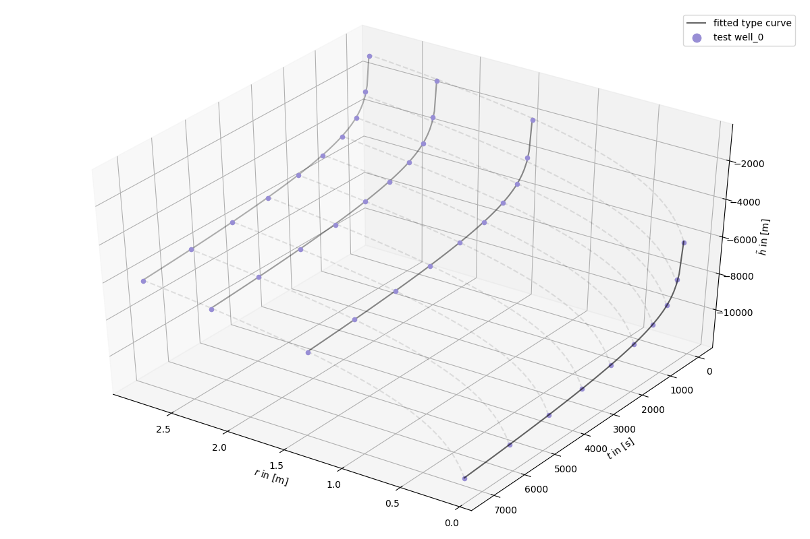
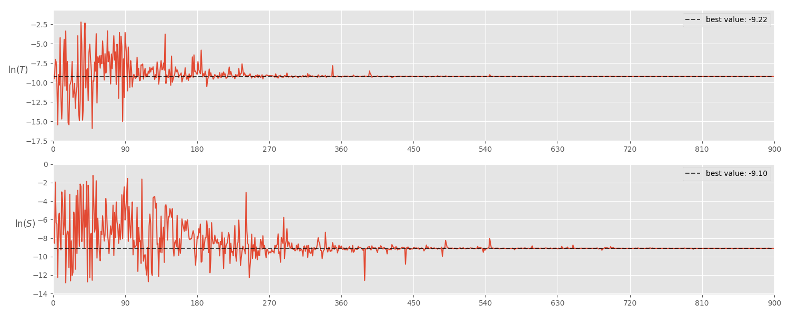
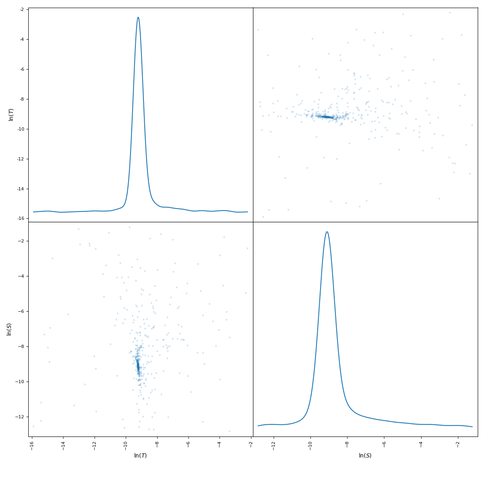

Tutorial 2: Estimate transmissivity and storativity
===================================================

The pumping test from example 1 can now be loaded and used to estimate the values for
transmissivity and storativity.

.. code-block:: python

    import welltestpy as wtp

    campaign = wtp.data.load_campaign("Cmp_UFZ-campaign.cmp")
    estimation = wtp.estimate.Theis("Estimate_theis", campaign, generate=True)
    estimation.run()

This will give the following plots:

The results are:

* `ln(T) = -9.22` which is equivalent to `T = 0.99 * 10^-4 m^2/s`
* `ln(S) = -9.10` which is equivalent to `S = 1.11 * 10^-4`
